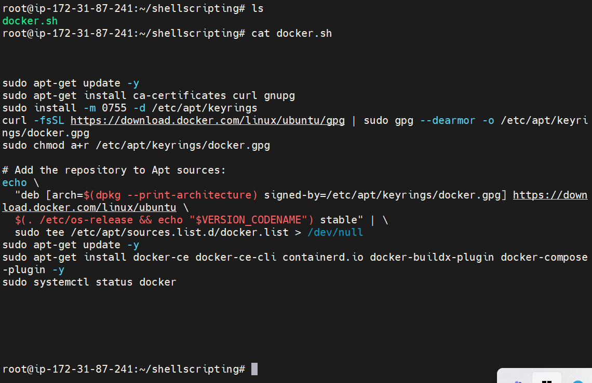

## Jenkins Pipeline Job

### _My First Job_

### _Webhook configured on github_

Webhook configured successfully on github using the ip address of the jenkins server. I also ensure to update the IP address whenever the server is restarted due to change in the ip address.

### _Jenkins job triggered_

The webhook configured on github is not all that is needed, while configuring the job i also ensure to check the the webhook github during the setup stage. This enables the jenkins job to run automatically whenever any changes is made to github which act as the source-code.
### _Jenkins pipeline script_

### _docker script_

An executable file name docker.sh was created to contain the script.

### _docker image install_

Docker was installed successfully and running(active) as seen in the image using the dicker script provided in the manual.

### _Jenkins pipeline job completed_

The pipeline job was completed after 5th trial. This gives me the insight into what i did wrong which i needed to adjust to arrive at the appropriate setup to have the needed result.

### _index.html content page_

The jenkins server now serving us with the content in the index.html

Thank you!!